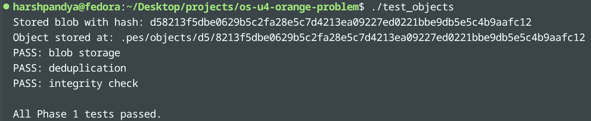
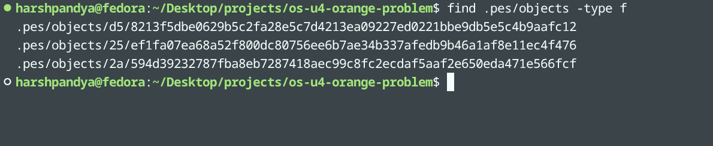
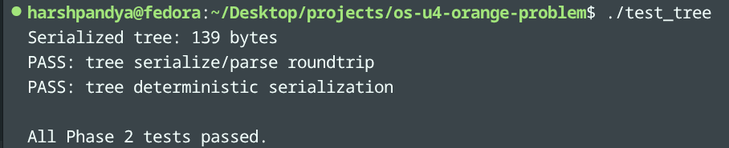
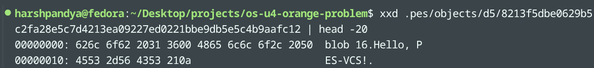
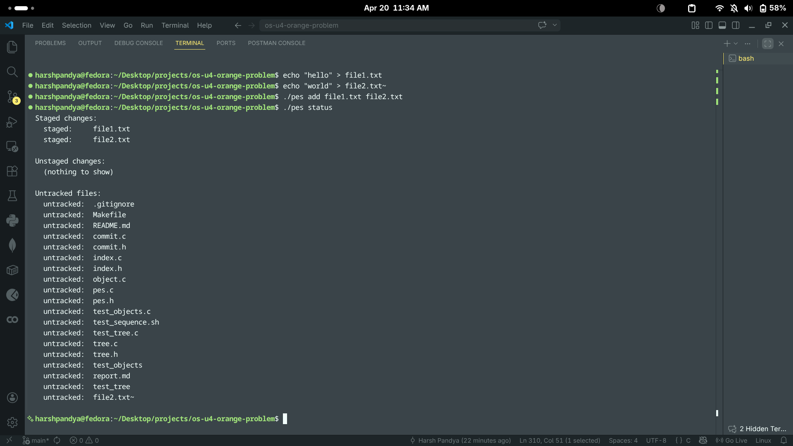
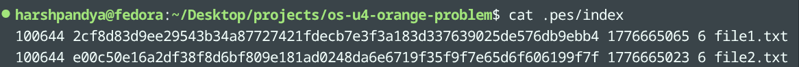

# PES-VCS Lab Report

## Student Details

- Name: Harsh Pandya
- SRN: PES1UG24CS182
- Repository: https://github.com/Seaweed-Boi/os-u4-orange-problem
- Date: 2026-04-20

## Work Completed So Far

### Phase 1: Object Storage Foundation

Completed implementation in [object.c](object.c):

- Implemented object_write:
  - Builds object payload as type + size + null separator + data.
  - Computes SHA-256 on full payload (header + data).
  - Supports deduplication by returning success when object already exists.
  - Creates sharded object directory if required.
  - Uses temp file + fsync + rename for atomic durable writes.
  - fsyncs shard directory after rename.
- Implemented object_read:
  - Reads full object file from path derived from hash.
  - Verifies integrity by recomputing hash and matching expected ObjectID.
  - Parses header safely (type and length).
  - Validates declared length with actual payload length.
  - Returns parsed type and extracted payload.

### Phase 1 Validation

Commands run:

```bash
make clean && make all && ./test_objects
```

Observed result summary:

- PASS: blob storage
- PASS: deduplication
- PASS: integrity check
- All Phase 1 tests passed

### Screenshot 1A (Required)

Output of test_objects with passing checks:



### Screenshot 1B (Required)

Object store sharded structure from .pes/objects:



### Phase 2: Tree Objects

Completed implementation in [tree.c](tree.c):

- Implemented tree_from_index:
  - Loads staged entries from `.pes/index`.
  - Recursively groups paths into directory levels.
  - Creates subtree objects for nested directories.
  - Writes serialized tree objects to the object store.
  - Returns root tree ObjectID for commit usage.

### Phase 2 Validation

Commands run:

```bash
make test_tree && ./test_tree
```

Observed result summary:

- PASS: tree serialize/parse roundtrip
- PASS: tree deterministic serialization
- All Phase 2 tests passed

### Screenshot 2A (Required)

Output of test_tree with passing checks:



### Screenshot 2B (Required)

Raw tree object representation (`xxd` excerpt):



### Phase 3: The Index (Staging Area)

Completed implementation in [index.c](index.c):

- Implemented index_load:
  - Loads `.pes/index` entries in text format.
  - Handles missing index file as a valid empty state.
  - Parses and validates hash fields using `hex_to_hash`.
- Implemented index_save:
  - Sorts entries by path before writing.
  - Writes index atomically via temp file + `fsync` + `rename`.
  - Uses heap-based sorting buffer to avoid stack overflow.
- Implemented index_add:
  - Reads file contents and stores blob via `object_write`.
  - Upserts index entries using `index_find`.
  - Updates mode, hash, mtime, and size metadata.
  - Persists index updates through `index_save`.

### Phase 3 Validation

Commands run:

```bash
make pes
./pes init
echo "hello" > file1.txt
echo "world" > file2.txt
./pes add file1.txt file2.txt
./pes status
cat .pes/index
```

Observed result summary:

- `pes add` stages both files successfully.
- `pes status` shows `file1.txt` and `file2.txt` under Staged changes.
- `.pes/index` contains sorted, human-readable entries for both files.

### Screenshot 3A (Required)

`pes init` → `pes add` → `pes status` sequence output:



### Screenshot 3B (Required)

Contents of `.pes/index` after staging:



## Progress Checklist

| Phase | Item | Status |
| --- | --- | --- |
| 1 | object.c (object_write, object_read) | Completed |
| 1 | Screenshot 1A | Added |
| 1 | Screenshot 1B | Added |
| 2 | tree.c (tree_from_index) | Completed |
| 2 | Screenshot 2A | Added |
| 2 | Screenshot 2B | Added |
| 3 | index.c (index_load, index_save, index_add) | Completed |
| 3 | Screenshot 3A | Added |
| 3 | Screenshot 3B | Added |
| 4 | commit.c | Pending |
| Final | Integration test evidence | Pending |


## Notes

- This report currently includes completed work up to Phase 3 (object storage, tree objects, and index staging), with screenshots 1A/1B, 2A/2B, and 3A/3B.

- Remaining implementation phases will be appended as work progresses.

## Phase 5 Analysis (Q5.1 Only)

**Q5.1:** A branch in Git is just a file in `.git/refs/heads/` containing a commit hash. Creating a branch is creating a file. Given this, how would you implement `pes checkout <branch>` — what files need to change in `.pes/`, and what must happen to the working directory? What makes this operation complex?

To implement `pes checkout <branch>` in PES, the core metadata change is simple:

1. Verify `.pes/refs/heads/<branch>` exists.
2. Update `.pes/HEAD` to `ref: refs/heads/<branch>`.
3. Read the commit hash from `.pes/refs/heads/<branch>`.

After that, reconstruct the target snapshot in the working directory:

1. Read the target commit object and get its root tree hash.
2. Recursively walk tree objects and materialize files/directories into the working tree.
3. For each blob entry, read object data and write file contents.
4. Apply mode bits (for example executable vs non-executable).
5. Remove tracked files/directories that exist in the current checkout but not in the target tree.
6. Rewrite `.pes/index` to match the checked-out tree state.

The complexity is mostly in safe working-directory updates, not ref updates. The difficult parts are:

1. Detecting conflicts with local uncommitted changes before overwriting files.
2. Handling deletes/renames across nested directories without leaving stale paths.
3. Preserving correct file modes and deterministic tree-to-filesystem reconstruction.
4. Making checkout crash-safe (avoid half-switched state if interrupted).
5. Keeping `HEAD`, branch ref, working tree, and index consistent as one logical transaction.

